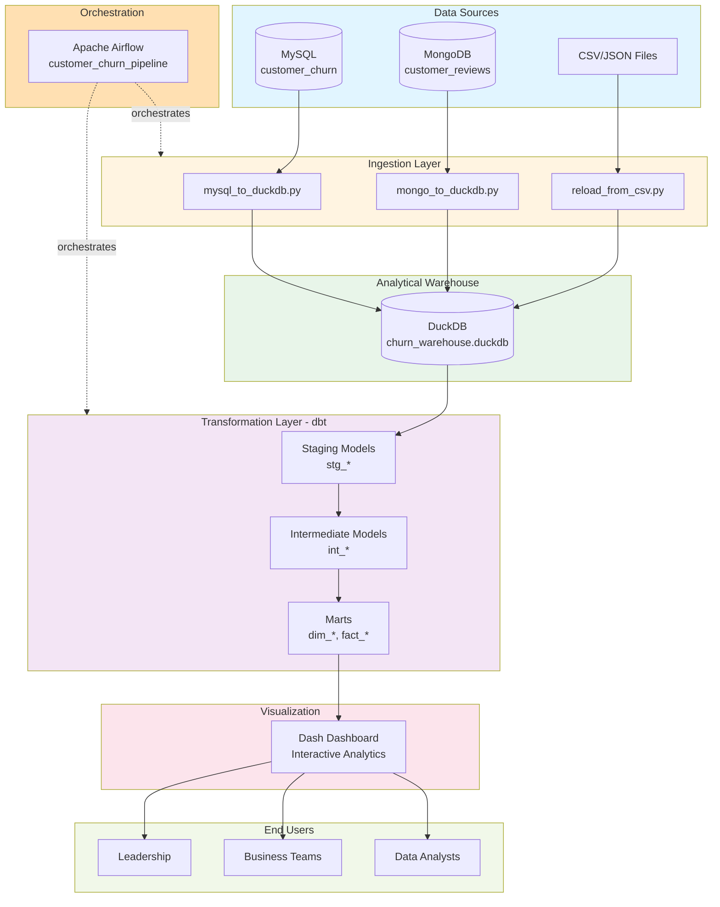
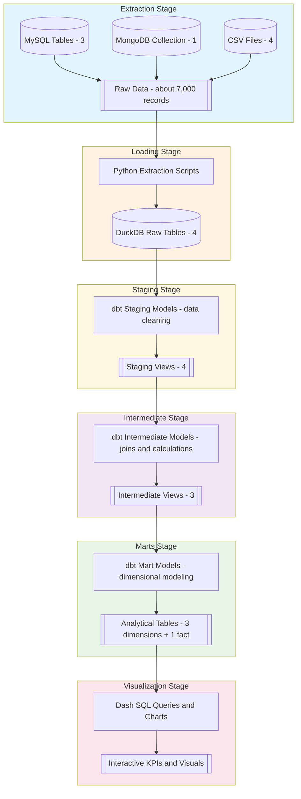

# Diagrams and Visual Documentation

This document provides information about the visual diagrams required for the Customer Churn Analytics Platform, including how to generate them and what they should contain.

---

## Overview

The project requires the following visual documentation:
1. **System Architecture Diagram** - End-to-end system overview
2. **Data Flow Diagram** - Data movement through the pipeline
3. **Entity Relationship Diagram (ERD)** - Database schema relationships
4. **dbt Model Lineage Graph** - Transformation dependencies

---

## 1. System Architecture Diagram

### Purpose
Provides a high-level overview of all system components, their interactions, and data flow from source to visualization.

### Components to Include

**Data Sources Layer:**
- MySQL Database (with database name)
- MongoDB Atlas (with collection info)
- CSV/JSON Files (with file names)

**Ingestion Layer:**
- Python scripts (mysql_to_duckdb.py, mongo_to_duckdb.py, reload_from_csv.py)
- Connection arrows to DuckDB

**Storage Layer:**
- DuckDB (churn_warehouse.duckdb)
- Show raw tables: customer_churn_data, customer_location, zip_population, customer_reviews

**Transformation Layer:**
- dbt logo/box
- Show three sublayers:
  - Staging (stg_* models)
  - Intermediate (int_* models)
  - Marts (dim_*, fact_* models)
- Show lineage arrows between layers

**Orchestration Layer:**
- Apache Airflow logo/box
- Show DAG: customer_churn_pipeline
- Show task flow with arrows

**Visualization Layer:**
- Dash/Plotly logo
- Show dashboard components:
  - KPI cards
  - Charts and graphs
  - Filters and controls

**End Users:**
- Data Analysts
- Business Stakeholders
- Executive Leadership

### Recommended Tools
- **Draw.io** (diagrams.net) - Free, web-based or desktop
- **Lucidchart** - Professional diagramming tool
- **Microsoft Visio** - Enterprise standard
- **Mermaid** - Code-based diagrams (can be rendered to PNG)
- **PlantUML** - Text-based diagrams

### Export Format
- **Primary**: PNG (high resolution, 300 DPI)
- **Alternative**: PDF (vector format, scalable)
- **Source File**: .drawio or .xml for future editing

### Template (Mermaid Code)



---

## 2. Data Flow Diagram

### Purpose
Illustrates the movement of data through the pipeline, showing transformations at each stage.

### Content to Include

**Flow Stages:**

1. **Extraction**
   - Source: MySQL tables (3 tables)
   - Source: MongoDB collection (1 collection)
   - Source: CSV files (4 files)
   - Output: Raw data

2. **Loading**
   - Process: Python extraction scripts
   - Output: DuckDB raw tables (4 tables)

3. **Staging**
   - Input: Raw tables
   - Process: dbt staging models (data cleaning)
   - Output: Staging views (4 views)

4. **Intermediate**
   - Input: Staging views
   - Process: dbt intermediate models (joins, calculations)
   - Output: Intermediate views (3 views)

5. **Marts**
   - Input: Intermediate views
   - Process: dbt mart models (dimensional modeling)
   - Output: Analytical tables (4 tables: 3 dimensions + 1 fact)

6. **Visualization**
   - Input: Mart tables
   - Process: SQL queries from Dash
   - Output: Interactive charts and KPIs

### Data Volume Indicators
Add data volume at each stage:
- Raw: ~7,000 customer records
- Staging: Same row count, cleaned
- Marts: Denormalized, ready for analytics

### Recommended Format
- **Swimlane diagram** showing horizontal flow
- **Color coding** for different data types (structured, semi-structured)
- **Annotations** for transformation logic


---

## 3. Entity Relationship Diagram (ERD)

### Purpose
Shows the database schema in the marts layer, including tables, columns, data types, and relationships.

### Tables to Include

**Fact Table:**
- `fact_churn`
  - churn_id (PK)
  - customer_id (FK → dim_customer)
  - service_id (FK → dim_service)
  - location_id (FK → dim_geography)
  - churn_date
  - churned (boolean)
  - tenure_months
  - monthly_charges
  - total_charges
  - revenue_impact

**Dimension Tables:**
- `dim_customer`
  - customer_id (PK)
  - gender
  - senior_citizen
  - partner
  - dependents
  - tenure_months
  - churn_flag

- `dim_geography`
  - location_id (PK)
  - zip_code
  - city
  - state
  - population
  - density

- `dim_service`
  - service_id (PK)
  - phone_service
  - internet_service
  - contract
  - payment_method
  - monthly_charges

### Cardinality
- fact_churn : dim_customer (N:1)
- fact_churn : dim_service (N:1)
- fact_churn : dim_geography (N:1)

### Star Schema Layout
Place `fact_churn` in the center with dimension tables around it in a star pattern.

### ERD Tools
- **dbdiagram.io** - Simple, web-based
- **MySQL Workbench** - Reverse engineer from database
- **DBeaver** - Can generate ERD from DuckDB
- **Draw.io** - Manual creation with ERD shapes
- **PlantUML** - Code-based ERD

  

### Template (dbdiagram.io syntax)

```
Table fact_churn {
  churn_id varchar [pk]
  customer_id varchar [ref: > dim_customer.customer_id]
  service_id varchar [ref: > dim_service.service_id]
  location_id varchar [ref: > dim_geography.location_id]
  churn_date date
  churned boolean
  tenure_months integer
  monthly_charges double
  total_charges double
  revenue_impact double
}

Table dim_customer {
  customer_id varchar [pk]
  gender varchar
  senior_citizen boolean
  partner boolean
  dependents boolean
  tenure_months integer
  churn_flag boolean
}

Table dim_geography {
  location_id varchar [pk]
  zip_code varchar
  city varchar
  state varchar
  population integer
  density double
}

Table dim_service {
  service_id varchar [pk]
  phone_service boolean
  internet_service varchar
  contract varchar
  payment_method varchar
  monthly_charges double
}
```

---

## 4. dbt Model Lineage Graph

### Purpose
Visualizes the dependencies between dbt models, showing the transformation flow from staging to marts.

### How to Generate

#### Automated Generation (Recommended)

```bash
# Navigate to dbt project
cd dbt/churn_analytics

# Ensure models are compiled
dbt compile

# Generate documentation
dbt docs generate

# Serve documentation locally
dbt docs serve
```

This will:
1. Open a browser at `http://localhost:8080`
2. Show interactive documentation
3. Include a visual lineage graph (click "View Lineage Graph" button)
4. Display model dependencies with color coding

#### Export Lineage Graph

**Option 1: Screenshot**
1. Open dbt docs (`dbt docs serve`)
2. Click on a mart model (e.g., `fact_churn`)
3. Click "View Lineage Graph" button
4. Take screenshot (high resolution)
5. Save as `dbt_lineage_graph.png`

**Option 2: Export as PNG (using browser dev tools)**
1. Open dbt docs
2. Right-click on lineage graph
3. "Inspect Element"
4. In console: `document.querySelector('svg').outerHTML` to get SVG
5. Convert SVG to PNG using online tool or Inkscape

**Option 3: Third-party Tools**
- **dbt-docs-to-notion** - Export docs to Notion
- **dbt-artifacts** - Export lineage data
- **Custom script** - Parse `manifest.json` and generate diagram

### What the Lineage Graph Shows

**Nodes:**
- Source tables (green)
- Staging models (blue)
- Intermediate models (yellow)
- Mart models (red)

**Edges:**
- Dependencies between models
- Direction of data flow

**Example Path:**
```
customer_churn_data (source)
    ↓
stg_customer_churn (staging)
    ↓
int_customer_metrics (intermediate)
    ↓
fact_churn (mart)
```

---

## 5. Demonstration Video

### Purpose
A 3-minute video showcasing the end-to-end platform functionality.

### Required Content

**Segment 1: Airflow Pipeline (60 seconds)**
- Show Airflow UI at `http://localhost:8080`
- Display the `customer_churn_pipeline` DAG
- Trigger the DAG manually
- Show task progress (green = success)
- Highlight: reload_csv → dbt_deps → dbt_run → dbt_test

**Segment 2: dbt Transformation (45 seconds)**
- Open dbt documentation (`dbt docs serve`)
- Navigate through model structure:
  - Staging folder
  - Intermediate folder
  - Marts folder
- Click on `fact_churn` model
- Show lineage graph
- Highlight model description and columns

**Segment 3: Dash Dashboard (75 seconds)**
- Open dashboard at `http://localhost:8050`
- Showcase KPI cards:
  - Total customers
  - Churn rate
  - Revenue at risk
- Interact with filters (date range, demographics)
- Show different chart types:
  - Bar chart (churn by contract type)
  - Pie chart (churn by service)
  - Line chart (churn trend over time)
  - Heatmap (churn by geography)

**Segment 4: Key Insights (30 seconds)**
- Narrate 2-3 business insights:
  - "Month-to-month contracts have highest churn"
  - "Fiber optic customers churn more than DSL"
  - "Senior citizens have 41% churn rate"
- Show how insights inform business decisions

### Production Guidelines

**Tools:**
- **Screen Recording**: OBS Studio (free), Camtasia, ScreenFlow, Loom
- **Video Editing**: DaVinci Resolve (free), Adobe Premiere Pro, Final Cut Pro
- **Narration**: Clear audio, professional tone
- **Resolution**: 1920x1080 (Full HD) minimum
- **Format**: MP4 (H.264 codec)
- **Duration**: Strictly 3 minutes (±10 seconds acceptable)

**Best Practices:**
- Use cursor highlighting for important clicks
- Add text annotations for key points
- Use zoom-in effects for readability
- Include intro/outro slides (5 seconds each)
- Background music (optional, keep subtle)
- Rehearse script before recording

### Script Template

```
[Intro - 5 seconds]
"Welcome to the Customer Churn Analytics Platform demonstration."

[Airflow - 60 seconds]
"Let's start with the orchestration layer powered by Apache Airflow.
Here's our customer_churn_pipeline DAG that runs daily.
I'll trigger it manually to show the workflow.
Notice the task dependencies: data ingestion, then dbt transformation, then testing.
All tasks completed successfully, shown in green."

[dbt - 45 seconds]
"Next, let's look at our data transformations built with dbt.
This is our auto-generated documentation showing model lineage.
We have staging models that clean raw data,
intermediate models that join datasets,
and marts that create our final analytical tables.
This lineage graph shows how fact_churn depends on multiple staging models."

[Dash - 75 seconds]
"Now for the visualization layer - our interactive Dash dashboard.
At the top, we have key performance indicators.
Currently showing 7,043 total customers with a 26.5% churn rate.
Let's explore churn patterns.
This chart shows month-to-month contracts have the highest churn.
Filtering by service type reveals fiber optic customers churn more.
The geographic heatmap identifies high-churn regions."

[Insights - 30 seconds]
"Key insights from our analysis:
One: Month-to-month contracts represent the highest churn risk.
Two: Senior citizens have a 41% churn rate versus 23% for younger customers.
Three: Customers without tech support churn at twice the rate.
These insights enable targeted retention strategies."

[Outro - 5 seconds]
"Thank you for watching. The complete code is available on GitHub."
```

### File Storage

**Recommended:**
- Upload to **YouTube** (unlisted or public)
- Upload to **Vimeo**
- Include in GitHub repository (if <100MB)
- Use **GitHub Releases** for larger files
- Link in README.md

**Documentation:**
Add to README.md:
```markdown
## 📹 Demonstration Video

Watch the full platform demonstration (3 minutes):
[](https://youtube.com/watch?v=VIDEO_ID)

[Direct link](https://youtube.com/watch?v=VIDEO_ID)
```

---

## Implementation Checklist

### Pre-Requisites
- [ ] All pipeline components running successfully
- [ ] Sample data loaded
- [ ] dbt models compiled and run
- [ ] Dashboard showing data

### Diagram Creation
- [ ] System Architecture Diagram created and exported (PNG/PDF)
- [ ] Data Flow Diagram created and exported (PNG/PDF)
- [ ] ERD created showing star schema (PNG/PDF)
- [ ] dbt lineage graph generated and exported (PNG)
- [ ] All diagrams saved to `docs/diagrams/` folder
- [ ] Diagram source files (.drawio, .xml) committed to repo

### Video Creation
- [ ] Script written and reviewed
- [ ] Screen recording completed (3 minutes)
- [ ] Video edited with annotations
- [ ] Exported in correct format (MP4, 1080p)
- [ ] Uploaded to video hosting platform
- [ ] Link added to README.md
- [ ] Thumbnail created

### Documentation Updates
- [ ] README.md updated with diagram references
- [ ] README.md updated with video link
- [ ] TECHNICAL.md includes diagram descriptions
- [ ] All diagrams properly labeled and captioned

---

## File Organization

Recommended directory structure:

```
docs/
├── diagrams/
│   ├── system_architecture.png
│   ├── system_architecture.drawio (source)
│   ├── data_flow_diagram.png
│   ├── data_flow_diagram.drawio (source)
│   ├── erd_star_schema.png
│   ├── erd_star_schema.dbml (source)
│   ├── dbt_lineage_graph.png
│   └── thumbnail.png (for video)
├── videos/
│   └── README.md (with video links)
├── SETUP.md
├── TECHNICAL.md
├── DATA_DICTIONARY.md
├── DIAGRAMS.md (this file)
└── MISSING_INFO_GUIDE.md
```

---

## Quality Standards

### Diagrams
- **Resolution**: Minimum 1920x1080 for PNG exports
- **Readability**: Text should be legible at 100% zoom
- **Consistency**: Use same color scheme across all diagrams
- **Legend**: Include legend for colors/symbols used
- **Labels**: All components clearly labeled
- **Export**: Both PNG (for viewing) and source format (for editing)

### Video
- **Duration**: Exactly 3 minutes (±10 seconds)
- **Resolution**: 1920x1080 minimum
- **Audio**: Clear narration, no background noise
- **Pacing**: Not too fast, allow viewers to follow
- **Captions**: Optional but recommended for accessibility
- **File Size**: Optimize for web (<500MB preferred)

---

## Tools Reference

### Free Tools
- **Draw.io**: https://app.diagrams.net/
- **dbdiagram.io**: https://dbdiagram.io/
- **Mermaid Live**: https://mermaid.live/
- **OBS Studio**: https://obsproject.com/
- **DaVinci Resolve**: https://www.blackmagicdesign.com/products/davinciresolve

### Paid Tools
- **Lucidchart**: https://www.lucidchart.com/
- **Microsoft Visio**: https://www.microsoft.com/en-us/microsoft-365/visio
- **Camtasia**: https://www.techsmith.com/video-editor.html

### Online Converters
- **SVG to PNG**: https://cloudconvert.com/svg-to-png
- **Video Compression**: https://www.handbrake.fr/

---

*This document should be updated as diagrams are created and the demonstration video is recorded.*

*Last Updated: October 2025*
